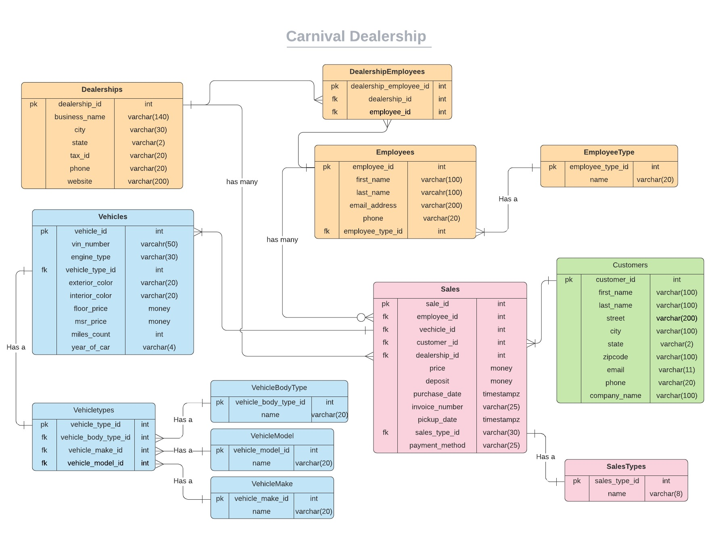

# Improving the Carnival Database

Carnival's intern Monique had extra time to really get familiar with database normalization and data relationships and found that she could improve her ERD. Below is the ERD that she thinks will improve the quality of her database. Use this ERD as the basis for the following group work. 

## Goals

 - Using CREATE to add new tables
 - Using ALTER to change the structure of a table and its data.
 - Adding foreign key contraints
 - Identifying the order of operations for each query
 - Running a data migration to alter data values
 

## Getting Started   

At this point you should have the Carnival database with tables and data already imported into pgAdmin. If not please refer to the *Importing Data* chapter. With your teammates, use pgAdmin to execute a series of improvements on the database that Monique made in her new ERD. Use the ERD to identify the chnages she made by comparing the original script we used to create the database [here](./database/carnival_db_schemas.sql). Be prepared to discuss your improvements as a team and why you made them. 

## Practice: Adding new tables for Carnival

Use the Carnival ERD to identify the tables that are still missing in your database.

1. Which tables need to be created after reviewing the ERD?
2. What levels of normalization will these new tables be supporting?
3. Do any of these tables have a foreign key in another table? What is the child table that would hold the foreign key(s).

## Practice: Running a data migration

What is a data migration? It is simply moving/changing your data from one location to another.

A data migration will need to take place for Carnival where we will convert text to integers. Since that is not a learning requirment at this point we are providing the SQL script for you to conduct this.

The result of the script will change all the text words to id integers. The important thing to note is that the data migration script does not change the datatype of these fields. You will be respnonsible for changing the datatype in the next practice below.

<a href="./database/vehicle_type_data_migration.sql">Review data migration SQL here </a>

## Practice: Altering a Table
With the addition of our new tables, Carnival is changing the way their data relates between tables, what needs to be done to the child table still?

1. What kind of changes need to take place to the child table and the data? 
2. What potential problems arise in the child table now that we need to add the foreign keys?
3. Write and run the SQL statement(s) that are required to make these structural changes.
