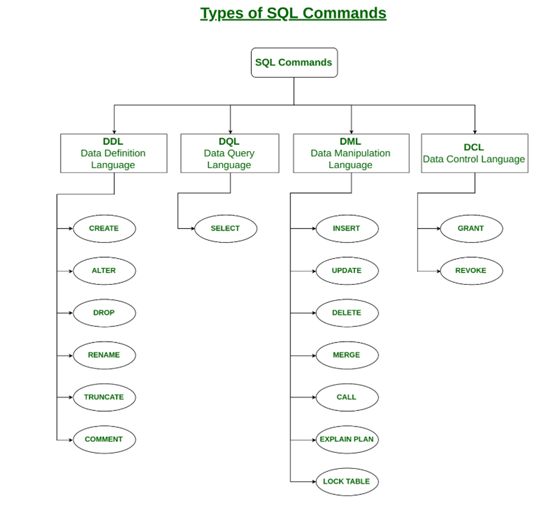

# Creating and Altering Database Tables

This chapter will show how to use the `CREATE TABLE` statement to create the table, the attributes, and the relationship constraints. We will also touch on the ALTER TABLE statement to change an existing table.

## Tools

1. PostgreSQL - You should already have PosgreSQL installed from the Getting Started Chapter.

2. pgAdmin - Should come along with the installation of your PostgreSQL.

3. Reference for [pgAdmin 4 Documentation](https://www.pgadmin.org/docs/pgadmin4/latest/index.html)

## Goals

After this chapter, doing the exercises, and discussing with your instructor, you should understand the following concepts.

1. Creating a table in your database
2. Altering an existing table
3. Adding relationship constraints

<br>

## Carnival's Next Steps
Monique did a great job with the initial database. But we noticed that she didnt normalize her data enough. When we take a look at her VehicleType what do you notice?

## Practice: VehicleType Normalization

Review Carnival's the ERD and identify what you need to do to normalize the VehicleTypes Table.

1. What tables still need to be created?
1. What are the relationships can you identify?
1. Which should hold the primary key of the other as a foreign key?

<br>

## How to create a table

We are all set with our PostgreSQL database now created. We will begin to practice our SQL skills. 

To initially create a database we use what is called a Data Definition command, known as `CREATE` statement. The diagram below shows other SQL commands and their categorization within the SQL language.




### The `CREATE TABLE` Statement
The `CREATE TABLE` statement is used for creating a new table. Here is a simple example statement. "*CREATE TABLE* is followed by the  name of the table, then opening/closing pararenthesis which contain all the fields (attributes) of the table.

``` 
CREATE TABLE my_first_table (
    first_column TEXT,
    second_column INT
); 
```

### Before we can move on, let's discuss Data Types.
What is a data type? In relational databases, data types tell us what the data requirements are for a field. From the example above you can see we are giving a data type to each field on the table. The *first_column* requires data to be stored as a data type of *TEXT* and the *second_column* must be stored as an *INT*. 

### Short list of Data Types
| Data Types  | Example usage |
| ------------- | ------------- |
| Integer  | int(2)  |
| Character varying  | varchar(50)  |
| Boolean  | bool  |
| Numeric  | decimal(2)  |s
| Timestamp with time zone | timestampz  |

<br>

## Back to Carnival

Let's try creating a table for reals...Carnival has a Vehicles table that describes vehicles in inventory. Below is the create statment that Monique used to create the table. 

``` 
CREATE TABLE Vehicles (
  vehicle_id INT PRIMARY KEY GENERATED ALWAYS AS IDENTITY,
  vin VARCHAR(50),
  engine_type VARCHAR(2),
  vehicle_type_id INT REFERENCES VehicleTypes (vehicle_type_id),
  exterior_color VARCHAR(50),
  interior_color VARCHAR(50),
  floor_price INT,
  msr_price INT,
  miles_count INT,
  year_of_car INT
);
```

### Here are some things to note...
1. Table names are generally named in *UpperCamelCase* when there is more than one word in the name.
2. All attributes are called fields in the table, they are always snake_cased.
3. There is usually always a field for a primary key. *vehicle_id* is the primary key here. It must be explicitly defined as the primary key with *INT PRIMARY KEY GENERATED ALWAYS AS IDENTITY*.
4. Each field has a data type associated with it.
5. There is a FOREIGN KEY! What's that? We'll get to that next!

<br>


## Adding Foreign Key Constraint to new table

A foreign key constraint allows one table to be linked to another table. FOREIGN KEYs are a field (or collection of fields) from one table that references the PRIMARY KEY in another table. The table which hold the FOREIGN KEY is called the child table, and the table containing the candidate key is called the parent table.

To add a foreign key contraint when creating a table the following must be added to the CREATE TABLE statement for every field that need a contraint.


``` 

  FOREIGN KEY (vehicle_type_id) REFERENCES VehicleType(vehicle_type_id)

```
or simply append this statement on the same line as a field definition

``` 

  vehicle_type_id INT (vehicle_type_id) REFERENCES VehicleType(vehicle_type_id)

```

Sometimes we will need to change the structure of an already existing table. We use an ALTER TABLE statement to change things like field names, field data types, adding foreign key contraints etc.


## Adding Foreign Key Constraint to existing table

``` 
  ALTER TABLE child_table 
  ADD CONSTRAINT constraint_name 
  FOREIGN KEY (fk_columns) 
  REFERENCES parent_table (parent_key_columns);

```


