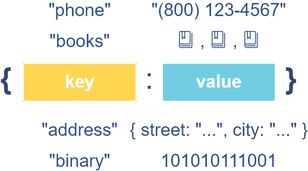
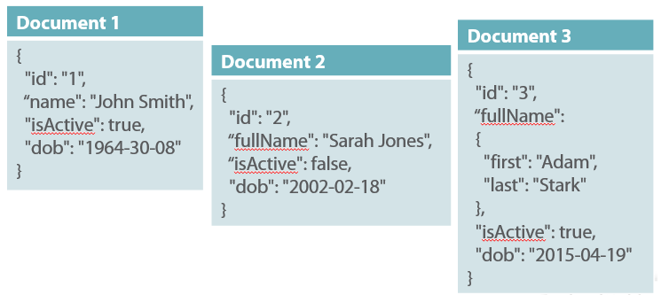
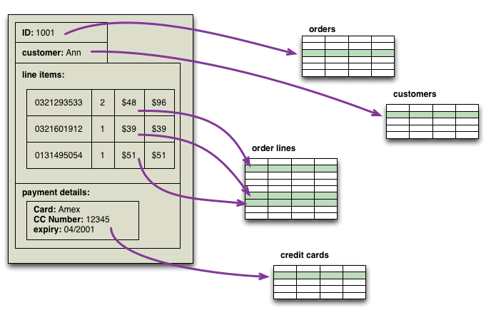

# Introduction to Databases
Databases are everywhere. Everyday you interact with databases whether you realize it our not. It can be through a website you visit or a contact list on your mobile phone or the checkout at the grocery store. The majority of the world's data resides in databases. 

Carnival has data that helps them keep track of their business operations such as data on dealerships, employees, vehicle inventory, customers & sales transactions.

Carnival did their research into the various types of database management systems to ensure they were choosing the best option. Below is a little of their research. Carnival decided a relational database management system was the best option for their company. 

<br>

## Two main ways to go with databases
Today databases are considered either relational (SQL) or non-relational (NoSQL) type. The fundamental differences between these two types of databases comes down to how the data gets stored, how the data is retrieved.

<br>

## Non-Relational Databases (NoSql)
Non-relational databases, otherwise known as NoSql (non SQL) databases are non-tabular and store their data differently than relational tables. Data can be organized in one of the four main ways, key-value store, document store, column-oriented store and graph database. Each type solves a problem that relational databases can't solve. Let's look a little deeper.


### Key-value type
###
Typically key-value databases are known as key-value cache databases that are stored in memory. Using memory allows data to be accessed more quickly than using a call to a SQL databases. It also has the simplest data structure and is highly scalable. Some key-value store engines that exist are [Redis](https://redis.io/) and [Amazon DynamoDB](https://docs.aws.amazon.com/amazondynamodb/latest/developerguide/Introduction.html)
<br/><br/>


##
### Document store type
###
This diagram dispays a JSON document. However other document types could be used such as XML or YAML. These databases allow for dynamic data structures (schemaless) and the ability to process large datasets. Some document database engines are [MongoDB](https://www.mongodb.com/) and [Amazon DynamoDB](https://docs.aws.amazon.com/amazondynamodb/latest/developerguide/Introduction.html). What is a document store good for? [Read more](https://www.mongodb.com/document-databases)
<br/><br/>


##
### Wide-Column Stores type
###
This diagram compares a traditional relational database on the left to two column-oriented databases on the right. Wide-column databases are good when you have large datasets on distriubuted systems. They can reduce the amount of time it takes to search for the data that you need. Some column-oriented database engines are [Apache Cassandra](https://cassandra.apache.org/doc/latest/) & [Apache HBase](https://hbase.apache.org/book.html#arch.overview). 
What is a wide-column store good for? [Read more](https://www.forbes.com/sites/metabrown/2018/03/31/get-the-basics-on-nosql-databases-wide-column-store-databases/#74fe3f856e50)
<br>

##
### Graph Type

Graph databases store data in a relationship map. It's built for storing billions of relationships, much like a network. It's structure allows for querying that is more similiar to the way people think. Commonly used for social networking, recommendation engines, life sciences, knowledge graphs, network/IT operations and fraud detections. Some graph database engines are [ArangoDB](https://www.arangodb.com/arangodb-training-center/graphs/), [Neo4j](https://neo4j.com/developer/get-started/) and [Dgraph](https://dgraph.io/docs/).  What is a graph database good for? [Read more](https://neo4j.com/why-graph-databases/)
<br><br>


<br><br>

## Relational Databases (SQL)

Relational databases are the time-tested standard for storing data. You'll most likely be more familiar with the table, column, and row structure that reflect relational databases (Reminicent to Excel in some ways). Relational databases are built with a predefined schema before you can add the data to the database. For example, you define a customer table with columns for first name, last name and email, once this is complete then you can think about interacting with the database data.

To be able to communicate with a relational database a working knowledge of SQL (Structured Query Language) is required. SQL is a programming language which is used by humans and machines for interacting with databases and will be the focus of this course.

#### Below is a SQL statement that allows us to retrieve all the orders by a specific customer.
```
select * from orders where customer_id = 1;
```
<br>

### Relational type



<br>
<br>

Relational database engines you might have heard of include [MySQL](https://dev.mysql.com/doc/refman/8.0/en/), [PostgreSQL](https://www.postgresql.org/docs/12/index.html), [SQLite](https://www.sqlite.org/docs.html), [Microsoft SQL Server](https://docs.microsoft.com/en-us/sql/sql-server/?view=sql-server-ver15), [Amazon Aurora](https://docs.aws.amazon.com/AmazonRDS/latest/AuroraUserGuide/CHAP_AuroraOverview.html), and [Oracle](https://docs.oracle.com/en/database/oracle/oracle-database/index.html).

## Bonus Reading
 [More on the four main types of NoSql databases](https://www.mongodb.com/scale/types-of-nosql-databases)

