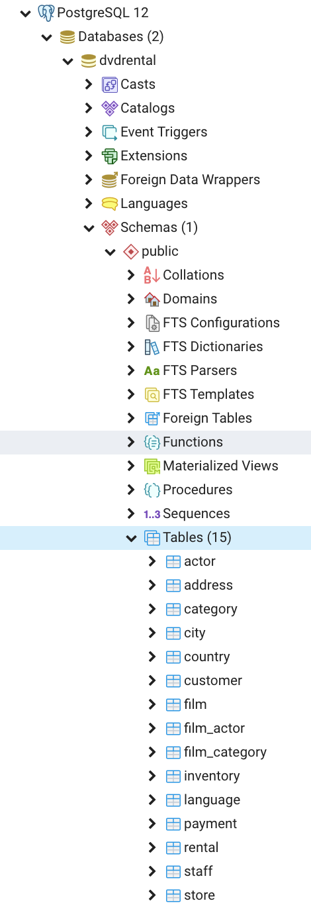
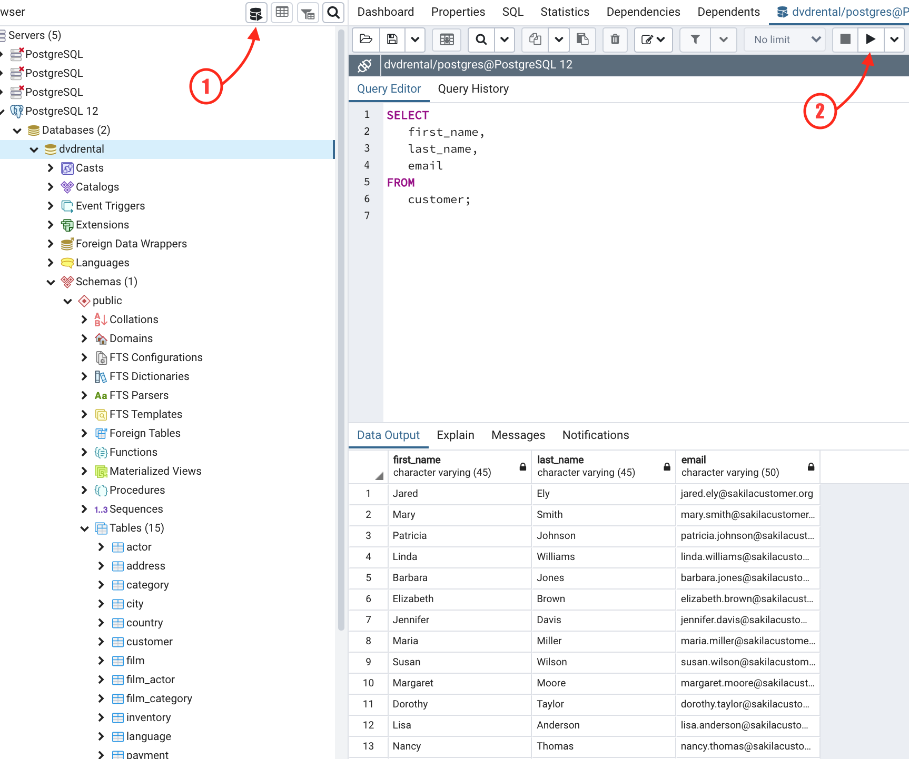

# Installations

## PostgreSQL

### Installing PostgreSQL Server & pgAdmin 4

We will be using PostgreSQL throughout this course for your relational database management system. pgAdmin is the GUI application we will use to manage and interact with our databases. And psql is the interactive terminal for Postgres.

Follow the instructions at the appropriate links below to install PostgreSQL Server, pgAdmin and psql.

- [Mac OS](https://www.postgresqltutorial.com/install-postgresql-macos/)
- [Windows PC](https://www.postgresqltutorial.com/install-postgresql/)

#### Mac OS: Error on Database Restore

If you get `Failed (exit code: -6)` when you are trying to restore the dvdrental database, please download [the latest version of pgAdmin](https://www.pgadmin.org/download/pgadmin-4-macos/) and replace the current one in your Applications directory.

Make sure to restart any open pgAdmin windows.

## Connecting to your server & Loading a database

Once you are done with installations, continue the tutorial:

1. [Connect To a PostgreSQL Database Server](https://www.postgresqltutorial.com/connect-to-postgresql-database/)
1. [Load PostgreSQL Sample Database](https://www.postgresqltutorial.com/load-postgresql-sample-database/) In this part of the tutorial, scroll down until you get to the section called **Load the DVD Rental database using the pgAdmin**. This is where you should start.


#### Query Editor

Once you have restored the test database, you can see your tables by navigating into the `dvdrental > Schemas > Public > Tables`.



Now you can try running a query!

Make sure your dvdrental db is selected. In the image below, **1** opens your query editor. Type in the following:

```sql
SELECT
   first_name,
   last_name,
   email
FROM
   customer;
```

Click the icon labeled **2** to run your SELECT statement and make sure you get back results.



## Lucidchart

If you don't already have one, create a new Lucidchart account by going [here](https://app.lucidchart.com/users/registerLevel#/createAccount) and clicking the **Continue with Free** button.

## Google Account

If you do not have a Google email, please register for one [here](https://accounts.google.com/signup/v2/webcreateaccount?flowName=GlifWebSignIn&flowEntry=SignUp). This will be used primarily for utilizing Google Sheets.

## Github

Github is the primary site that software developers throughout the world use to store their code, and share it with other developers. Visit the [sign up page](https://github.com/join) and create your own, free account if you don't have one.

## Git Bash for Windows

If are on a Windows PC and do not have a command line application installed, please follow the instructions [here](https://gitforwindows.org/) to install Git Bash.

**The following installation instructions are to be done in your command line (Terminal for Macs & Git Bash/WSL for Windows).**

## Homebrew

Visit the [homebrew home page](http://brew.sh/) and follow the single instruction there to get it installed.

## Git

Git is how you and your teammates will work on a shard codebase during your time at NSS. Type in the following command to install.

```sh
brew install git
brew install tig
```

### Configuring Git

Once Git is done being installed, watch the video on how to [set up global Git configuration](https://youtu.be/66EB9oxGMzQ) so that you can successfully back up your code to Github in a few days... once we show you how to do it.

### Handling Permission Issues After Setup

Sometimes, a student has permission issues after installing and configuring Git. To ensure that this doesn't happen to you, watch the [Owning Your Git Config Directory](https://youtu.be/exva3J_jojc) video and follow the steps.

## Show Hidden Files

While you have your terminal open, enter in the following command.

```sh
defaults write com.apple.finder AppleShowAllFiles YES
```

## SSH Key

SSH is a technology that allows you to create a very secure connection between your computer, and a computer located somewhere else in the world. It's an acronym for Secure Shell. When you create an SSH key on your computer, it actually creates two files

1. A public key file that you share with other people and computers. It is usually named `id_rsa.pub`.
1. A private key file that you never, ever, ever, ever, ever share with anyone. It is usually named `id_rsa`.

### Creating Your SSH Key

Watch a short video for [creating an SSH key in the terminal](https://youtu.be/znRMcNG9_qQ) so that you can work with Github.

### Add SSH Key to Github Account

Now watch the video for [adding your SSH key to your Github account](https://youtu.be/8hlmIObpMd4).
