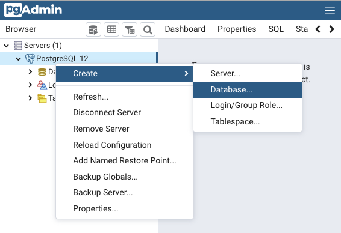

# Importing Data

This chapter will prepare you in the initial steps of creating a new database, setting up tables and importing new data.

## Tools

1. PostgreSQL - You should already have PosgreSQL installed from the Getting Started Chapter.

2. pgAdmin - Should come along with the installation of your PostgreSQL.

3. Reference for [pgAdmin 4 Documentation](https://www.pgadmin.org/docs/pgadmin4/latest/index.html)

## Goals

After this chapter, doing the exercises, and discussing with your instructor, you should understand the following concepts.

1. Creating a new database
2. How to import SQL statements via a .sql file
3. How to import data via a .csv file

 

## Carnival's Next Steps
Before Carnival can import their CSV data to the database they need to FIRST create a database and THEN define the tables schemas using SQL.

Instead of hiring a SQL expert, Carnival decided to save money and assign their super smart intern, Monique to the task of creating a database as well as preparing the SQL statements required to set up the Carnival database table schemas. Monique chose to save her SQL statements in a .sql file which she plans to import and run. Then, and only then can Monique do another import of the data from the Carnival .csv files.

[Download Monique's .sql file here](./database/carnival_db_schemas.sql), we will use it to create the carnival database table schemas. We'll see how she did!

 

## Creating a new database

For this course you will use pgAdmin for all of your database interactions. pgAdmin is a browser-based software that connects to the local databases on your computer. It's important to note that this is not a cloud-based software. It is in fact installed on your machine. It just runs itself in the browser.

### How to create a database with pgAdmin?

1. Open pgAdmin. Once you launch pgAdmin you should see a screen that looks like a directory with a top level folder named > Servers.

 
 

2. Your next step is to open the > *Servers* directory to see contained directory structure. Note that the *Schemas* directory will hold your new tables schemas once we create them.

 
 

3. Right click on *PostgreSQL 12* and hover over  *Create* and then click on *Database*.

 
 

4. Then, simply name the database and click *Save*.

 
 

4. You should now be able to see your new database nested under the *Databases* directory.

 
 

## Importing SQL statements via .sql file

Now we are ready to import the tables schemas. We will do this with Monique's .sql file.

PgAdmin has a feature called *Query Tool* , which allows you to write SQL statments or import .sql files. Click on the *Query Tool* icon   in the menu bar and then we will proceed with importing the .sql file by clicking on the *Open File* icon  .

At this point you should see all of Monique's SQL statments loaded into the Query Editor window. Once you see the SQL statements you can execute the SQL by pushing the *Execute/Refresh* icon  .

All of the tables schema information lives inthe Schemas directory.

## Importing data via .csv files

Now that the database and tables are Monique is ready to import the actual data from Carnival's .csv files.

Within the Schemas directory you will see a listing of the tables in the database. Right click on the Customers table and click Import/Export.

 
 

The Import/Export data modal will allow you to specify how to import the data. In our situation, We want to *flip the toggle* to Import, *Choose* csv as the file format and *Browse* to find our Customers csv file. Next, we will need include the Headers and *type in* a "," in for our delimiter.

Lastly, click the _Columns_ tab in the window and uncheck the column for the primary key. This is because the database will be responsible for generating those, and the ones in the CSV file should be ignored.

Then click the _OK_ button to start the import.
