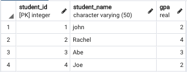
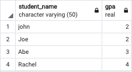
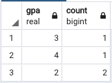

# Aggregation and Grouping

This chapter covers aggregation functions

1. MAX()
2. MIN()
3. SUM()
4. COUNT()
5. AVG()

Thse funtions are usually used with the companion `GROUP BY` clause in `SELECT` queries.


## Resources to Browse Before Class

- [Aggregate Functions in SQL](https://www.youtube.com/watch?v=sgAvl7ry5jY)
- [Aggregate Functions Tutorial](https://www.postgresqltutorial.com/postgresql-aggregate-functions/)
- [Understanding Group By Clause](https://www.youtube.com/watch?v=Yvuw0dbd7OQ)
- [Group By Tutorial](https://www.postgresqltutorial.com/postgresql-group-by/)


## Aggregate Functions

Aggregrate functions run calculations on many rows and return one resulting row.

### `MAX()` - Returns the row with the maximum value

```sql
-- MAX statement to find the Highest GPA in the class:
SELECT MAX(gpa) FROM Students;
```
<br>

### `MIN()` - Returns the row with the minium value

```sql
-- MIN statement to find the lowest GPA in the class:
SELECT MIN(gpa) FROM Students;
```
<br>

### `COUNT()` - Returns the number of rows

```sql
-- COUNT statement to find the total number of Students in a class:
SELECT COUNT(*) FROM Students;
```
<br>

```sql
-- COUNT statement to find how many students have a gpa greater than 2.5:
SELECT COUNT(gpa) FROM Students where gpa > 2.5;
```

<br>

### `AVG()` - Returns the mean of rows provided

```sql
-- AVG statement to find the average grade for students in a class:
SELECT AVG(gpa) FROM Students;
```

<br>

### `SUM()` - Returns the total sum of row values selected

```sql
-- SUM statement to find the total cost of all teacher salaries:
SELECT SUM(salaries) FROM Teachers;
```


## Group By
 The GROUP BY clause is used to group the results of a SELECT query based on one or more columns.

Consider a Student table that looks like this:



<br>
<br>

 Example query to group students by their gpa.

 ```sql
 -- Here we want to query a list of students grouped by their gpa
SELECT student_name, count(gpa)
FROM Students GROUP BY gpa
 ```
<br>

The Result would look like this:

 

<br>
<br>

We could also group gpa by using an aggregate function like COUNT.

```sql
 -- Here we want to query a list of students gpas and find how many times a particular gpa occurs.
SELECT gpa, count(gpa)
FROM Students GROUP BY gpa;
 ```
<br>
 
  