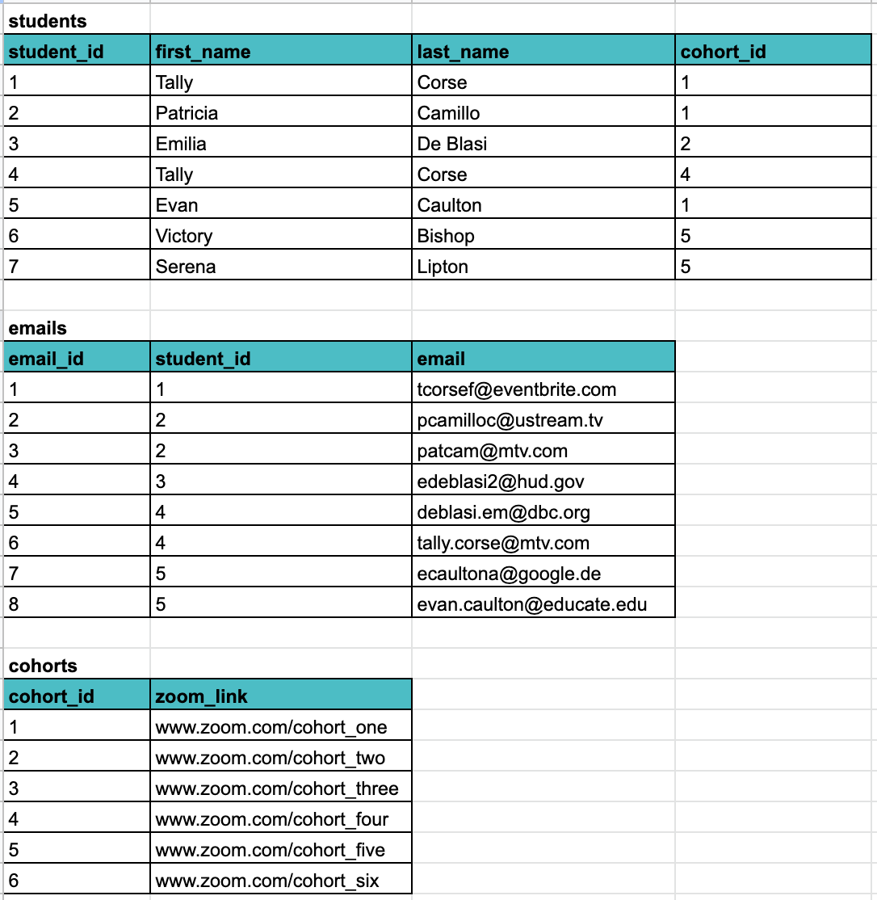
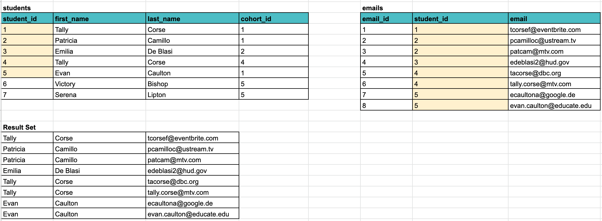
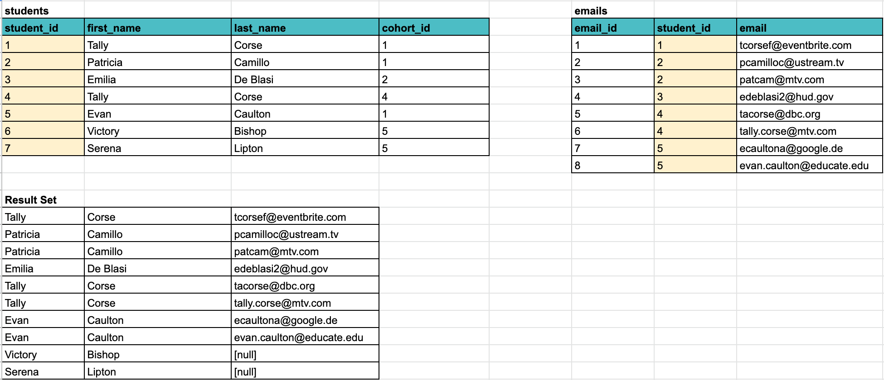
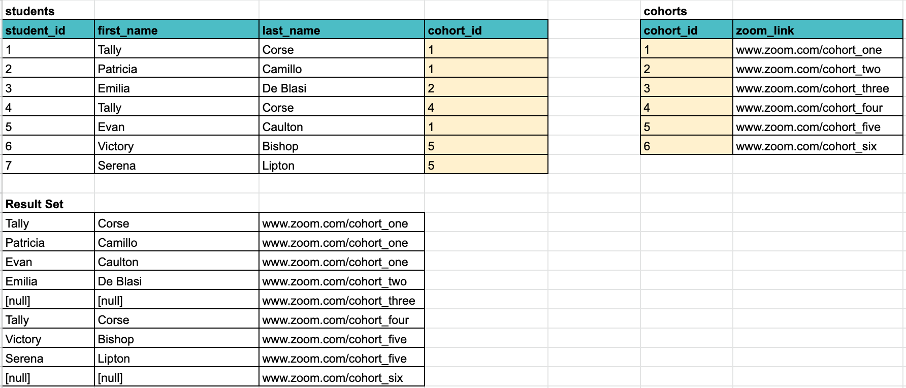

# Joining Tables

A `JOIN` clause allows us to access data from more than one table based on the relationships between the tables. Given two or more tables, based on the columns that relates the tables, we can utilize the data based on the data relationships. Most often, the columns are the primary key in one table and the foreign key in a related table.

## Resources to Browse Before Class

- [PostgreSQL Joins](https://www.postgresqltutorial.com/postgresql-joins/)
- [PostgreSQL INNER JOIN](https://www.postgresqltutorial.com/postgresql-inner-join/)
- [PostgreSQL LEFT JOIN](https://www.postgresqltutorial.com/postgresql-left-join/)
- [PostgreSQL RIGHT JOIN](https://www.postgresqltutorial.com/postgresql-right-join/)
- [Video: What is a Join? ](https://www.youtube.com/watch?v=-20RIzxdKZQ)
- [Video: SQL Joins Explained](https://www.youtube.com/watch?v=9yeOJ0ZMUYw)
- [Video: SQL Joins Tutorial for Beginners](https://www.youtube.com/watch?v=2HVMiPPuPIM)

Let's use the following data to talk about three different kinds of joins: inner join, left join and right join.



## INNER JOIN

An `INNER JOIN` lets us select data from two related tables. The two table names are listed on either side of the keywords `INNER JOIN`. Next comes the keyword `ON` followed by the join predicate. The join predicate is the condition that must be satisfied for the data to be selected from both tables.

Let's look at an example. We want the list of students who have email addresses in our database and the email addresses associated with each of those students.

This means that we will be doing a inner join between the students table and the emails table. The relationship between these two tables is one to many, one student can have many email addresses. Therefore, there's a FK for `student_id` on the emails table. We will utilize this relationship to write our join predicate.

```sql
SELECT
    first_name,
    last_name,
    email
FROM
    students
INNER JOIN emails
    ON students.student_id = emails.student_id;
```

For each row in the students table, inner join compares the value in it's `student_id` column with the value in the `student_id` column of every row in the emails table:

If these values are equal, the inner join creates a new row that contains the `first_name` and `last_name` columns from the students table and the `email` column from the emails table. This new row is then added to the result set.

In case these values are not equal, the inner join just ignores them and moves to the next row.




## LEFT JOIN

With a left join, all the rows from the table listed on the left side of the keywords `LEFT JOIN` will be part of the result set regardless of the join predicate.

This time, we want all the students whether they have an email address or not.

```sql
SELECT
    first_name,
    last_name,
    email
FROM
    students
LEFT JOIN emails
    ON students.student_id = emails.student_id;
```

For each row in students (the left table), it compares the value in it's `student_id` column with the value of each row in the `student_id` column of the emails table (the right table).

If these values are equal, the left join clause creates a new row that contains columns from both tables that we specified in the SELECT clause and adds this row to the result set.

If the values are not equal, the left join clause still creates a new row that contains our specified columns. In addition, it fills the columns that come from the right table with NULL.



## RIGHT JOIN

The right join is the reverse of the left join. This means that all rows from the table on the right side of the `RIGHT JOIN` keywords will be returned in the result set regardless of whether there is an associated row in the table on the left side.

Let's get the zoom links for all the cohorts and the students, if any, that will be using each of the zoom links.

Keep in mind that students and cohorts have a many to one relationship, a cohort can have many students.

```sql
SELECT
    first_name,
    last_name,
    zoom_link
FROM
    students
RIGHT JOIN cohorts
    ON students.cohort_id = cohorts.cohort_id;
```

For each row in cohorts (the right table), it compares each value in it's `cohort_id` column with each value in the `cohort_id` column of every row in students (the left table).

If these values are equal, the right join creates a new row that contains columns from both tables.

Else, the right join creates a new row that contains columns from both tables. However, it fills the columns in the left table with NULL.



## Practice: Carnival

1. Get a list of the sales that was made for each sales type.
1. Get a list of sales with the VIN of the vehicle, the first name and last name of the customer, first name and last name of the employee who made the sale and the name, city and state of the dealership.
1. Get a list of all the dealerships and the employees, if any, working at each one.
1. Get a list of vehicles with the names of the body type, make, model and color.
